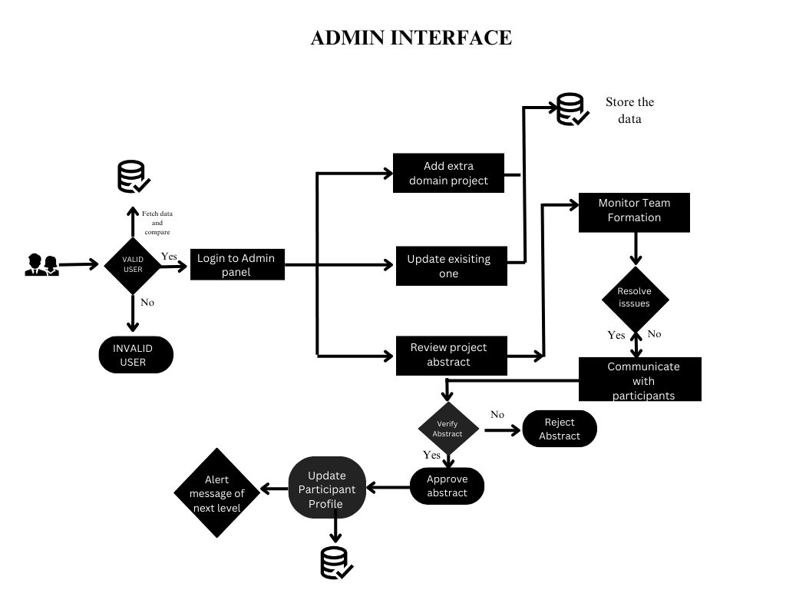
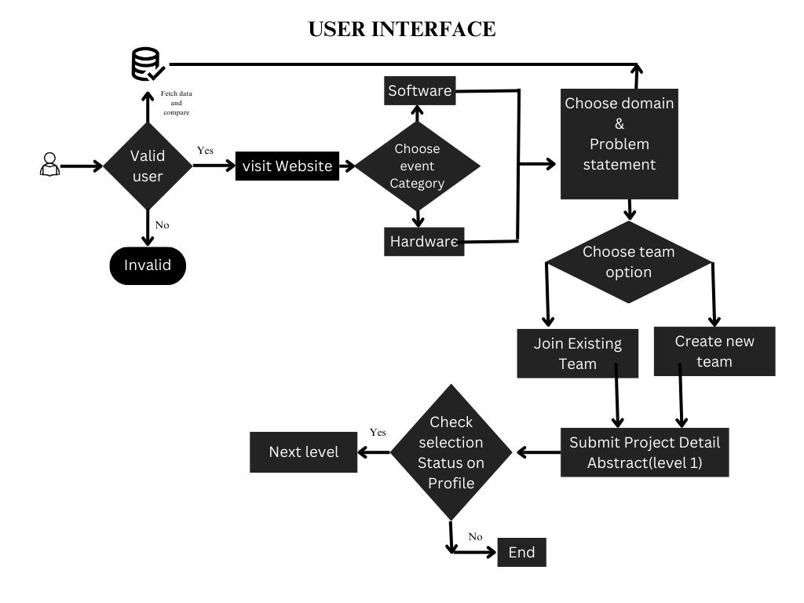

# Getting Started with Creating Event registration application using MERN (MongoDB, Express, React, Node)

This project was bootstrapped with [Create React App](https://github.com/facebook/create-react-app).

## Available Scripts

In the project directory, you can run:

### `npm start`

Runs the app in the development mode.\
Open [http://localhost:3000](http://localhost:3000) to view it in your browser.

### WorkFlow

1. User Management:
Students: Register, log in, participate in events, form teams, submit project abstracts, and track application status.
Admins: Add new domains or project categories, review abstracts submitted by student teams, and approve or reject them.
2. Event Categories and Domains:
The platform categorizes events (software or hardware) with multiple domains such as AR/VR, Full-stack, etc.
3. Team Formation:
Students can join or create new teams, promoting collaboration and team-based development.
4. Abstract Submission:
Teams submit project abstracts, detailing the project objectives and any relevant information.
5. Admin Review and Approval:
Abstracts submitted by teams are reviewed by administrators, who then approve or reject them to ensure quality and relevance.
6. Knowledge Sharing:
The platform facilitates knowledge sharing through forums, discussion boards, or other collaborative features.
7. Analytical Dashboard:
Administrators access this to monitor event progress, track team participation, and gather insights for future improvements.
8. System Requirements:
Functional Requirements: User management, event registration, team formation, abstract submission, admin dashboard, and analytics.
Non-Functional Requirements: Usability, performance, security, scalability, maintainability, and reliability.
9. System Architecture:
The software follows a client-server architecture with the front end using React.js, backend with Node.js and Express.js, and MongoDB for data storage. Secure APIs facilitate communication between the client and server.

;
;
